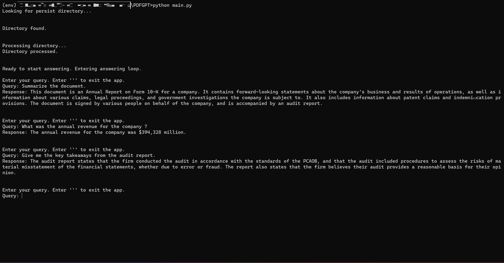

# PDFGPT
PDFGPT is a Python-based tool designed to provide users with a seamless way to extract information from PDF files using the OpenAI module. This application streamlines the process of querying text content from PDF documents, allowing users to quickly retrieve relevant information without manually parsing the files.

## Sample Output

Here are some sample outputs from the PDFGPT Application:


*Querying from this [file](https://annualreport.stocklight.com/nasdaq/aapl/221338448.pdf)*

## Features

- **Easy PDF Querying**: Users can input specific queries, and the application will search the provided PDF file for relevant information, making it an efficient alternative to manual document searching.

- **OpenAI Integration**: The application leverages the OpenAI module to perform natural language processing and understanding, ensuring accurate and context-aware query results.

- **Console Interface**: The application offers a simple and intuitive command-line interface, making it accessible to users with varying levels of technical expertise.

- **PDF Parsing**: The application utilizes libraries to extract text content from PDF files, enabling seamless integration with the OpenAI module for query processing.

## Why Use It

- **Time-Saving**: Manual searching through lengthy PDF documents can be time-consuming. This application automates the process, saving users valuable time and effort.

- **Precision**: By using natural language queries and OpenAI's advanced language processing capabilities, the application ensures accurate and contextually relevant results.

- **Efficiency**: The console-based interface is designed for efficiency, allowing users to quickly interact with the application without the need for a graphical user interface.

- **Accessibility**: This tool can be beneficial for researchers, students, professionals, and anyone who regularly works with PDF documents and seeks specific information within them.

## Installation and Usage

To use the PDFGPT application, follow these steps:

1. **Clone the Repository**:

   Open your terminal and navigate to a directory where you want to clone the repository:

   ```sh
   git clone https://github.com/AnshumanRoy/PDFGPT.git
   cd PDFGPT

2. **Install Requirements**:

   Install the required Python packages using pip by running the following command:

   ```sh
   pip install -r requirements.txt

3. **Configure API Key and File Path**:

   Create a configuration file named **config.ini** in the project directory. You can use a text editor to create and edit this file. Add your OpenAI API key and the path to the PDF file you       want to query:

   ```.ini
   [api_key]
   key = your-api-key

   [file]
   path = your-file-path
   
4. **Run the Application**:

   On the terminal, navigate to the parent folder of the directory and the run the application:

   ```.sh
   python main.py
   
